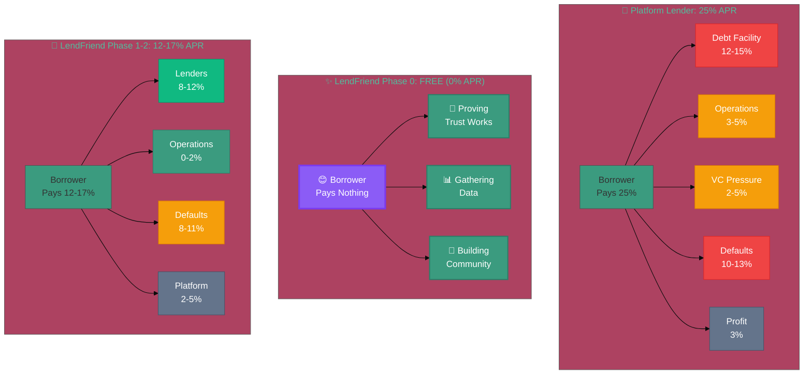

# Web3 Cost Advantage

Platform lenders like Shopify Capital and Stripe Capital charge 20-50% APR[[54]](references.md#ref54)[[55]](references.md#ref55)[[56]](references.md#ref56). Not because borrowers are risky—but because traditional financial infrastructure and VC-backed capital are expensive. Here's where those costs actually go, and how crypto infrastructure changes the equation.

---

## The Cost Breakdown: Where 25% APR Goes

When a platform lender charges **25% APR** for a small business loan, here's the actual breakdown:

| Component | Percentage | What It Covers |
|-----------|------------|----------------|
| **Cost of Capital** | 8-10% | VC equity demanding 20-30% returns[[70]](references.md#ref70) + debt facilities at 12-15%[[73]](references.md#ref73) |
| **Operating Costs** | 3-5% | ACH rails, settlement delays, reconciliation teams, compliance systems[[68]](references.md#ref68)[[72]](references.md#ref72) |
| **Default Risk Premium** | 10-13% | Actual loan losses (OnDeck: 13.6% charge-off rate[[74]](references.md#ref74)) |
| **Profit Margin** | 2-5% | Sustainable operations (industry avg: ~10%[[75]](references.md#ref75)) |
| **Total APR** | **23-33%** | Average: ~25% APR |

**Key insight:** About **11-15 percentage points** (nearly half the total rate) go to infrastructure and capital costs—not covering defaults.

---

## Why High Rates Don't Mean High Profits

If costs are so high, are lenders making huge profits? **No.** Many charge 20-50% APR and still struggle.

**Recent fintech lender struggles:**

- **Clearco:** Valuation dropped 90% (from $2B to $200M), laid off 72% of staff, both co-founders exited[[76]](references.md#ref76)
- **Wayflyer:** Lost €40.9M in 2023, only achieving monthly profitability by October 2023[[77]](references.md#ref77)
- **Affirm:** On pace to lose $800M in fiscal 2024, analysts predict unprofitability through 2026[[78]](references.md#ref78)
- **Uncapped:** Completely abandoned RBF model in 2024, cited structural problems[[79]](references.md#ref79)

**Why embedded lenders succeed:** Shopify and Stripe work because they see every transaction[[80]](references.md#ref80), have zero customer acquisition cost[[81]](references.md#ref81), and deduct repayments directly from sales[[82]](references.md#ref82). Standalone lenders can't compete without these advantages.

Between 2022-2024, fintech lending investment dropped to $51.9B—**the lowest since 2020**[[83]](references.md#ref83). The infrastructure cost crisis is real.

---

## Web3 Cost Advantage

LendFriend solves what platform lenders couldn't: **capital costs and infrastructure costs**.

### Understanding Capital Structure

**Platform Lenders (Complex Capital Stack):**
- Raise $10M VC equity (VCs want 20-30% returns[[70]](references.md#ref70) to make investment worthwhile)
- Borrow $50M from debt facilities at 12-15%[[73]](references.md#ref73)
- Must charge borrowers enough to: pay 12-15% debt interest + generate VC returns + cover operations + defaults
- Result: charge 25% APR, but only ~3% ends up as actual profit

**LendFriend (Direct Lending):**
- Community lenders provide capital directly (no VC, no debt facility)
- **Phase 0:** 0% interest loans to prove social trust works
- **Phase 1-2:** Lenders earn yield directly from borrower payments (typically 8-12%)
- No debt facility fees on top of lender yields
- No VC return pressure forcing higher rates
- Result: Phase 1-2 charge 12-17% APR, lenders get better risk-adjusted returns

**The Difference:** Platform lenders pay 12-15% to borrow money, THEN pay that borrowed money to lenders. We skip the middleman.

---

### Visual Breakdown: Where Your APR Goes

### Savings Breakdown

| Component | Platform Lenders | LendFriend | Savings |
|-----------|------------------|------------|---------|
| **💰 Capital Structure** | VC pressure + debt facility overhead | Direct P2P lending | **5-8pp** |
| **⚙️ Infrastructure** | ACH rails, manual ops, $500K-$2.5M launch[[68]](references.md#ref68)[[72]](references.md#ref72) | Stablecoins, smart contracts | **2-3pp** |
| **🤝 Social Trust** | Cashflow only | Cashflow + social graph | **1-2pp*** |

\* Social trust savings require Phase 0 validation

**Key insight:** Community lenders may earn SIMILAR yields (8-12%) to what debt facilities charge (12-15%), but borrowers pay less because there's no VC return pressure or debt facility overhead on top.

---

## The Math: 12-17% APR Instead of 25%

Starting from a **25% APR platform loan**:

- **Minus 5-8%** (community capital at 0% cost vs. VC-backed capital)
- **Minus 2-3%** (instant settlement, smart contract automation)
- **Minus 1-2%** (social trust reducing defaults—requires proof)
- **Plus 2-5%** (maintaining sustainable profit margins)

**Result: 12-17% APR** for similar borrower risk profile

This isn't charity—it's infrastructure arbitrage. Same borrowers, same default risk, different payment rails and capital structure.

---

## Why This Works Now

Five years ago, this wasn't possible. Today, the infrastructure converged:

1. **Stablecoins reached $305B supply** with $27.6T transfer volume[[57]](references.md#ref57)
2. **Social protocols emerging:** Farcaster (1M+ users[[65]](references.md#ref65)), Bluesky (20M+ users[[66]](references.md#ref66)) prove crypto-native identity can gain traction
3. **Smart contracts proven at scale:** $50B+ collateralized lending[[62]](references.md#ref62)
4. **Oracle networks and ZK proofs** enable secure platform data access (Shopify, Stripe, Coinbase Commerce)

All the pieces exist for the first time. We're assembling them for uncollateralized lending.

---

For full citations, see [Research Foundation](references.md)
