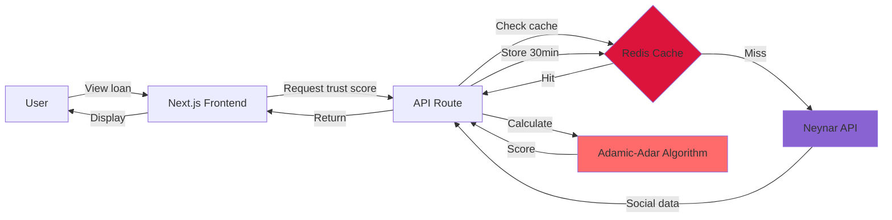
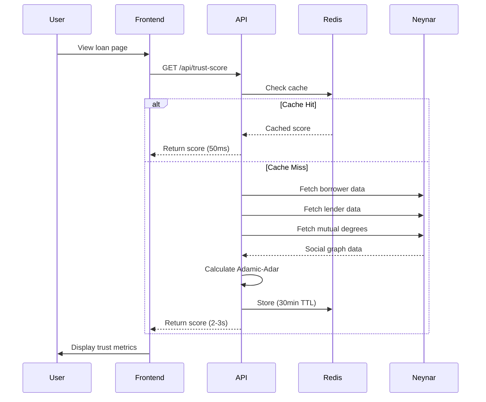
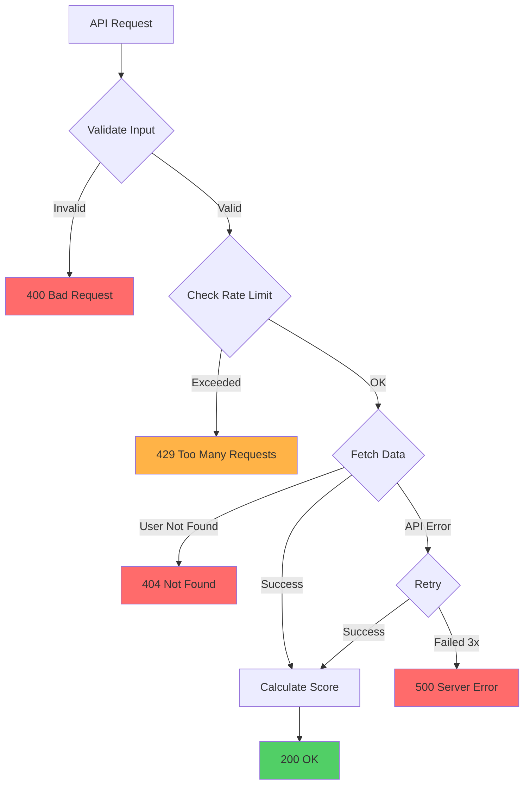

# Implementation

## Technical Details of Trust Score Calculation

Trust scores are calculated **off-chain** using the Farcaster social graph. This keeps gas costs low while leveraging rich social network data.

---

## Architecture



---

## Why Off-Chain?

Calculating trust scores on-chain would require:
- ❌ Storing entire social graph (millions of connections)
- ❌ Complex graph algorithms (high gas cost)
- ❌ Frequent updates (social graph changes daily)


**Off-chain calculation means:**
- ✅ Gas costs stay at ~$0.01 per transaction
- ✅ Trust scores calculated in 2-3 seconds
- ✅ No blockchain storage needed
- ✅ Fresh data from Farcaster


---

## Data Flow



---

## API Calls Per Score

### Required Data

1. Borrower followers (1 call)
2. Borrower following (1 call)
3. Lender followers (1 call)
4. Lender following (1 call)
5. Degree for each mutual connection (N calls)

**Total:** 4 + N calls

| Mutual Connections | Total API Calls | Time (Parallel) |
|-------------------|-----------------|-----------------|
| 10 | 14 | ~1.5s |
| 25 | 29 | ~2.5s |
| 50 | 54 | ~4s |

---

## Code Example

### Calculating Trust Score

```typescript
// apps/web/src/lib/socialProximity.ts

export async function calculateSocialProximity(
  borrowerFid: number,
  lenderFid: number
): Promise<TrustScore> {
  // Step 1: Fetch social networks
  const [borrowerNetwork, lenderNetwork] = await Promise.all([
    fetchNetwork(borrowerFid),
    fetchNetwork(lenderFid),
  ]);

  // Step 2: Find mutual connections
  const mutualFids = intersection(
    borrowerNetwork.allConnections,
    lenderNetwork.allConnections
  );

  // Step 3: Calculate Adamic-Adar score
  const adamicAdarScore = await calculateAdamicAdar(mutualFids);

  // Step 4: Apply quality weighting
  const avgQuality =
    (borrowerNetwork.quality + lenderNetwork.quality) / 2;
  const effectiveScore = adamicAdarScore * avgQuality;

  // Step 5: Calculate final score (0-100)
  const socialDistance = calculateFinalScore(
    effectiveScore,
    mutualFids.length,
    borrowerNetwork.size,
    lenderNetwork.size
  );

  // Step 6: Determine risk tier
  const riskTier =
    effectiveScore >= 10 || socialDistance >= 60 ? 'LOW' :
    effectiveScore >= 2.5 || socialDistance >= 30 ? 'MEDIUM' :
    'HIGH';

  return {
    mutualConnections: mutualFids.length,
    socialDistance,
    avgQuality,
    riskTier,
  };
}
```

### Adamic-Adar Calculation

```typescript
async function calculateAdamicAdar(mutualFids: number[]): Promise<number> {
  if (mutualFids.length === 0) return 0;

  // Fetch degrees in parallel for performance
  const degrees = await Promise.all(
    mutualFids.map(fid => fetchDegree(fid))
  );

  // Sum: 1 / log(degree) for each mutual
  let score = 0;
  for (const degree of degrees) {
    if (degree > 1) {
      score += 1 / Math.log(degree);
    } else {
      score += 1.0; // Max weight for very rare connections
    }
  }

  return score;
}
```

---

## Performance Optimization

### 1. Parallel Fetching
All API calls happen simultaneously using `Promise.all()`:

```typescript
// ❌ Sequential (slow)
const borrower = await fetchBorrower(fid);
const lender = await fetchLender(fid);
// Total: 4-6 seconds

// ✅ Parallel (fast)
const [borrower, lender] = await Promise.all([
  fetchBorrower(fid),
  fetchLender(fid),
]);
// Total: 2-3 seconds
```

### 2. Redis Caching

```typescript
// Check cache first
const cached = await redis.get(`trust:${borrowerFid}:${lenderFid}`);
if (cached) {
  return JSON.parse(cached);
}

// Calculate if not cached
const score = await calculateSocialProximity(borrowerFid, lenderFid);

// Store for 30 minutes
await redis.setex(
  `trust:${borrowerFid}:${lenderFid}`,
  1800, // 30 minutes
  JSON.stringify(score)
);
```

**Cache Hit Rate:** 60-80% after first week

### 3. Graceful Fallback

```typescript
async function fetchDegree(fid: number): Promise<number> {
  try {
    const data = await neynarClient.fetchUser(fid);
    return data.followerCount + data.followingCount;
  } catch (error) {
    console.warn(`Failed to fetch degree for FID ${fid}`);
    return 100; // Conservative estimate
  }
}
```

---

## Cost Analysis

### Neynar API Pricing

| Tier | API Calls/Month | Cost |
|------|----------------|------|
| Free | 10,000 | $0 |
| Starter | 100,000 | $50/mo |
| Pro | 1,000,000 | $200/mo |

### LendFriend Usage Projections

**Assumptions:**
- Average 19 API calls per trust score
- Average 10 lenders per loan
- 60% cache hit rate

| Loans/Month | Trust Scores | API Calls | Cost |
|------------|-------------|----------|------|
| 10 | 100 | 760 | $0 |
| 100 | 1,000 | 7,600 | $0 |
| 1,000 | 10,000 | 76,000 | $50 |
| 10,000 | 100,000 | 760,000 | $200 |


**Cost scales linearly**

At scale (10K loans/month): **$0.02 per loan** for trust scoring.

Negligible compared to loan values ($100-1000 average).


---

## Security

### API Key Protection

```typescript
// ❌ NEVER expose client-side
const neynarClient = new NeynarClient(process.env.NEYNAR_API_KEY);

// ✅ Always call from server-side API routes
export async function GET(request: Request) {
  const { borrowerFid, lenderFid } = await request.json();
  const score = await calculateSocialProximity(borrowerFid, lenderFid);
  return Response.json(score);
}
```

### Rate Limiting

```typescript
import { Ratelimit } from '@upstash/ratelimit';

const ratelimit = new Ratelimit({
  redis,
  limiter: Ratelimit.slidingWindow(30, '1 m'), // 30 requests per minute
});

export async function GET(request: Request) {
  const identifier = request.headers.get('x-forwarded-for') ?? 'anonymous';
  const { success } = await ratelimit.limit(identifier);

  if (!success) {
    return new Response('Too many requests', { status: 429 });
  }

  // Continue with calculation...
}
```

### Input Validation

```typescript
function validateFid(fid: unknown): number {
  if (typeof fid !== 'number' || fid < 1 || fid > 999999999) {
    throw new Error('Invalid Farcaster ID');
  }
  return fid;
}
```

---

## API Reference

### Calculate Trust Score

**Endpoint:** `POST /api/trust-score`

**Request:**
```json
{
  "borrowerFid": 12345,
  "lenderFid": 67890
}
```

**Response (200 OK):**
```json
{
  "mutualConnections": 25,
  "socialDistance": 45,
  "avgQuality": 0.85,
  "riskTier": "MEDIUM",
  "cached": false,
  "timestamp": "2024-01-15T10:30:00Z"
}
```

**Response (400 Bad Request):**
```json
{
  "error": "Invalid FID",
  "message": "borrowerFid must be a positive integer"
}
```

**Response (429 Too Many Requests):**
```json
{
  "error": "Rate limit exceeded",
  "retryAfter": 45
}
```

**Status Codes:**
- `200` Success
- `400` Invalid input
- `404` User not found on Farcaster
- `429` Rate limit exceeded
- `500` Internal server error

---

## Error Handling



**Error Strategy:**
- **User Not Found:** Return score of 0, HIGH RISK tier
- **Rate Limit:** Retry with exponential backoff (1s, 2s, 4s)
- **Network Timeout:** Fail after 5 seconds, use fallback degree
- **Cache Error:** Continue without cache (slower but functional)

---

## Monitoring Metrics

| Metric | Target | Alert Threshold |
|--------|--------|----------------|
| **Response Time (P95)** | <3s | >5s |
| **Cache Hit Rate** | >60% | <40% |
| **API Error Rate** | <1% | >5% |
| **Neynar Usage** | — | >80% of tier |

---

## Infrastructure

### Services

| Service | Purpose | Configuration |
|---------|---------|--------------|
| **Vercel** | API hosting | Edge functions, Node.js 20 |
| **Upstash Redis** | Cache | 30min TTL, 10GB limit |
| **Neynar** | Social data | Pro tier, rate limiting |

### Cost (MVP)

| Service | Monthly Cost |
|---------|-------------|
| Vercel | $20 |
| Upstash Redis | $0 (free tier) |
| Neynar API | $0-50 |
| **Total** | **$20-70** |

---

## Next Steps

- **Understand the algorithm?** → [The Algorithm](the-algorithm.md)
- **See risk classifications?** → [Risk Tiers](risk-tiers.md)
- **Curious about social dynamics?** → [Trust Cascades](trust-cascades.md)
- **Worried about gaming?** → [Sybil Resistance](sybil-resistance.md)

**Back to:** [Social Trust Scoring Overview](README.md)
