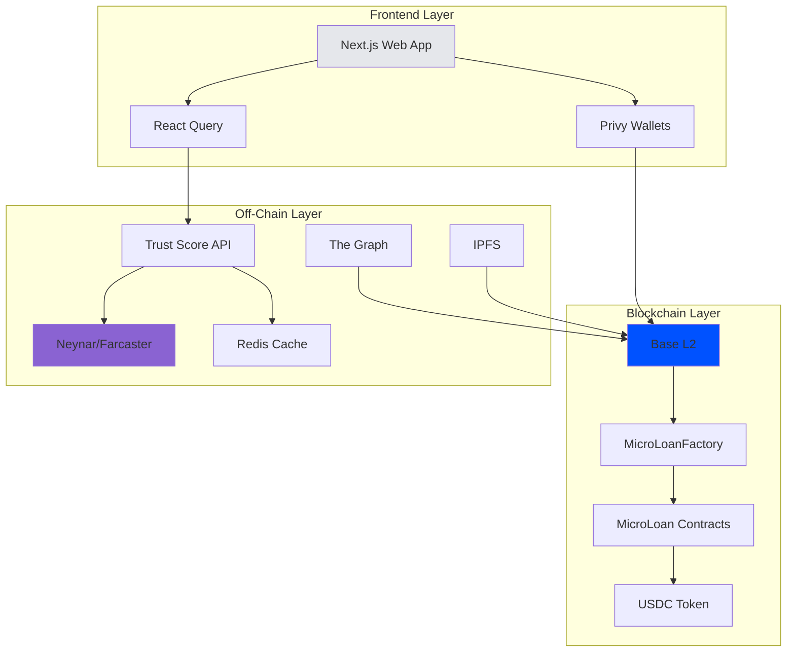

# Technical Stack

LendFriend is built on modern web3 infrastructure, prioritizing low costs, transparency, and ease of use.

---

## Blockchain

### Base L2 (Ethereum)

All loans live on [Base](https://base.org) - an Ethereum Layer 2 blockchain backed by Coinbase.

**Why Base?**
- **$0.01 transactions** - Lending $100 costs a penny, not $50
- **2-second confirmations** - Fast enough to feel instant
- **Ethereum security** - Inherits Ethereum's battle-tested security
- **Growing ecosystem** - 20M+ active addresses, USDC native support

**Network details:**
- Mainnet: Chain ID 8453
- Explorer: [basescan.org](https://basescan.org)

---

## Data Layer

### The Graph (Blockchain Indexing)

Reading blockchain data directly is slow and expensive. [The Graph](https://thegraph.com) indexes all loan events in real-time for instant queries.

**What we index:**
- All loans (amount, status, maturity date)
- All contributions (who funded what)
- All repayments (timing, amounts)
- Complete repayment history per borrower

This creates a **permanent, queryable credit history** visible to all future lenders.

---

### IPFS (Metadata Storage)

[IPFS](https://ipfs.tech) stores loan details too expensive to put on-chain (images, descriptions, budget breakdowns).

**Why IPFS?**
- Decentralized (no single point of failure)
- Immutable (can't edit loan terms after creation)
- Permanent (content addressed storage)
- Cost-effective

Each loan has an IPFS link stored on-chain. Once uploaded, metadata **cannot be changed** - ensuring transparency and preventing fraud.

---

## Frontend

**Built with:**
- Next.js 14 (modern React framework)
- Privy (embedded wallets + social login)
- Wagmi/Viem (Ethereum interactions)
- Tailwind CSS (clean, responsive design)

**Supports:**
- MetaMask, Coinbase Wallet, WalletConnect
- Email/SMS embedded wallets (no crypto needed)
- Mobile passkeys

---

## Infrastructure

**Hosting:**
- Vercel (frontend)
- Redis Cloud (caching)
- Neynar API (Farcaster data)
- Pinata (IPFS pinning)

**Cost:** $20-70/month for MVP

---

## Security

**Smart contracts:**
- OpenZeppelin standards
- Reentrancy guards
- Access control
- Input validation

**API:**
- Rate limiting
- Server-side API keys
- Input validation

**Audits:**
- Internal review complete
- External audit planned (Q2 2025)

**Bug bounty:** Up to $10,000 for critical vulnerabilities
📧 security@lendfriend.org

---

## Open Source

All code is MIT licensed:
- [github.com/aagoldberg/far-mca](https://github.com/aagoldberg/far-mca)

---

**Next:** [Smart Contract Flow](smart-contract-flow.md) · [Social Trust Scoring](social-trust-scoring/README.md) · [Risk & Default Handling](risk-and-defaults.md)
