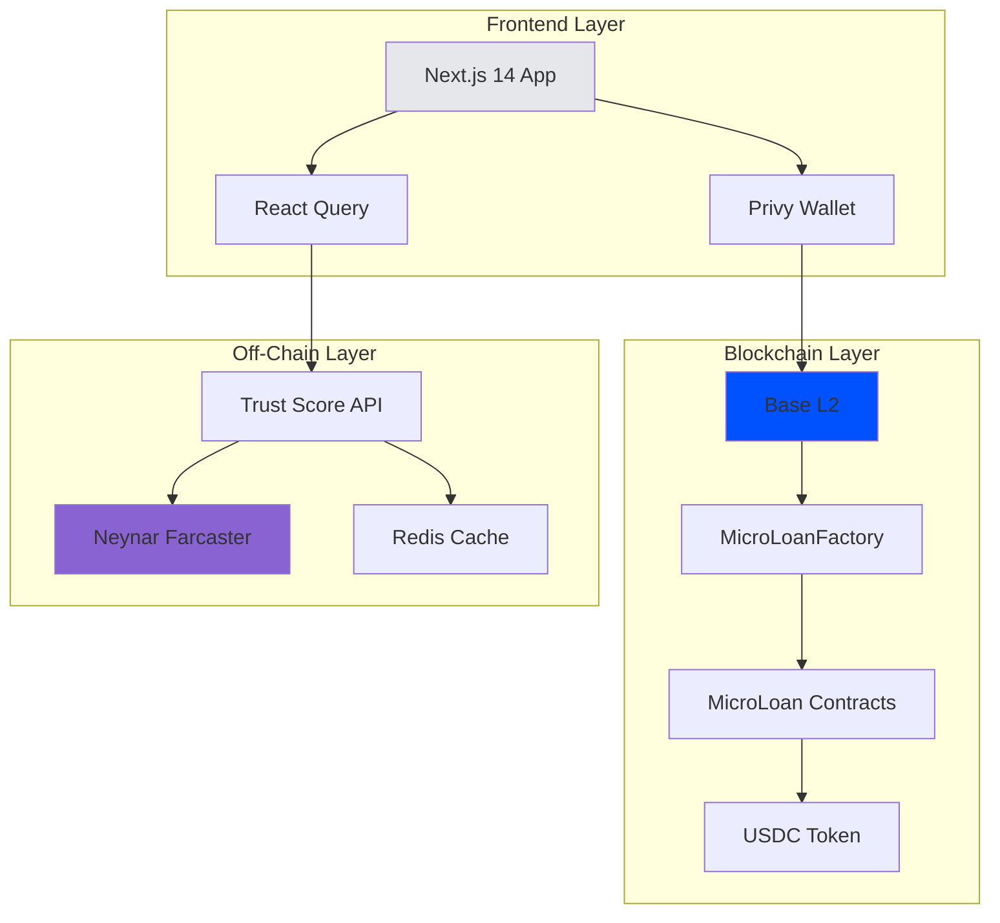
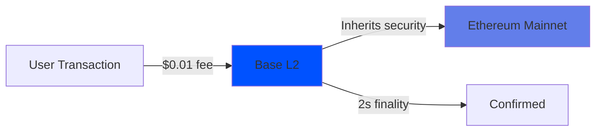
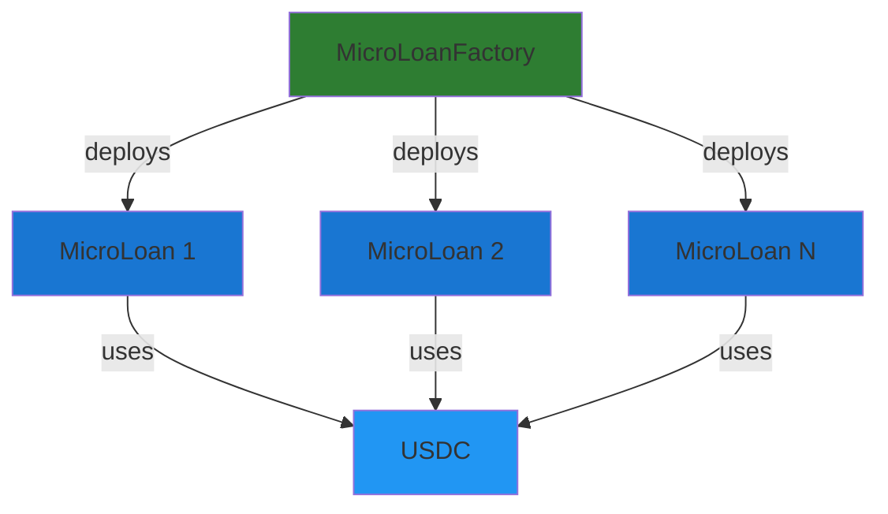
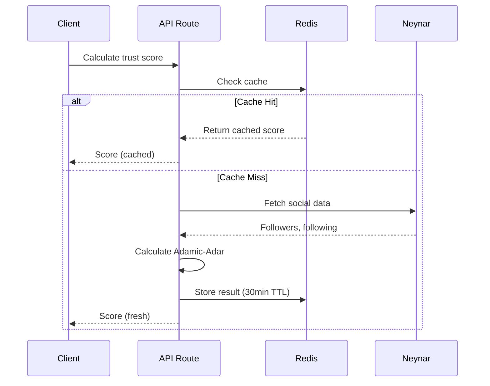

# Technical Stack

LendFriend is built on modern web3 infrastructure, prioritizing low costs, transparency, and developer experience.

---

## Blockchain Layer

### Base L2 (Ethereum)

**Why Base?**
- 🚀 **Low fees**: ~$0.01 per transaction
- ⚡ **Fast**: 2-second block times
- 🔒 **Secure**: Ethereum security guarantees
- 👥 **Growing**: Coinbase backing, active community

**Network:**
- Mainnet: Chain ID 8453
- Testnet: Chain ID 84532 (base-sepolia)
- Explorer: [basescan.org](https://basescan.org)

---

### Smart Contracts

**Architecture**: Factory Pattern

**MicroLoanFactory.sol**
- Deploys individual loan contracts
- Enforces constraints (min $100, max 365 days)
- Tracks one active loan per borrower

**MicroLoan.sol** (per loan)
- Handles contributions (ERC-20 transfers)
- Disburses funds when fully funded
- Tracks repayments with O(1) accumulator pattern
- Enables pro-rata claims for lenders

**Security:**
- ✅ Reentrancy protection (OpenZeppelin)
- ✅ Access control (Ownable)
- ✅ Overflow protection (Solidity 0.8+)
- ✅ Gas optimized (O(1) distribution)

---

### Currency: USDC

**Contract:** `0x833589fCD6eDb6E08f4c7C32D4f71b54bdA02913`

**Why USDC?**
- 💵 Dollar-pegged (minimizes volatility)
- 🏦 Trusted issuer (Circle)
- 🔄 Easy on/off ramps (Coinbase, exchanges)
- 📊 Native Base support

---

## Identity & Social Graph

### Farcaster Protocol

**What it provides:**
- Decentralized social network
- On-chain identities (FIDs)
- Cryptographic proof of connections
- Spam/bot filtering (quality scores)

**Why Farcaster?**
- ✅ Verifiable social graphs (can't fake)
- ✅ Quality scores filter spam
- ✅ Decentralized (no platform risk)
- ✅ Growing community (150k+ users)

**Data via Neynar API:**
- Follower/following lists
- User profiles
- Quality scores (0-1 scale)
- Connection metadata

---

## Frontend

### Next.js 14

**Key features:**
- App Router (React Server Components)
- Server Actions for mutations
- Image optimization
- Static + Dynamic rendering

### Wallet Integration

**Stack:**
- **Privy**: Embedded wallets + social login
- **Wagmi v2**: React hooks for Ethereum
- **Viem**: TypeScript Ethereum library

**Supported:**
- MetaMask, Coinbase Wallet, WalletConnect
- Email/SMS embedded wallets
- Passkey support (mobile)

### State & Styling

**State:**
- React Query (server state + caching)
- Zustand (client UI state)
- Wagmi (blockchain state)

**Style:**
- Tailwind CSS (utility-first)
- Headless UI (accessible components)
- Heroicons (icons)

---

## Off-Chain Computation

### Trust Score Service

**Performance:**
- Calculation: <100ms
- Cache TTL: 30 minutes
- Expected hit rate: 60-80%

---

## Infrastructure

### Hosting & Services

| Service | Purpose | Cost (MVP) |
|---------|---------|-----------|
| **Vercel** | Frontend hosting | $20/mo |
| **Redis Cloud** | Cache | $0 (free tier) |
| **Neynar API** | Social data | $0-50/mo |
| **IPFS** | Loan metadata | $0 |
| **Total** | — | **$20-70/mo** |

### Monitoring

- **Sentry**: Error tracking
- **Vercel Analytics**: Performance
- **Etherscan API**: Contract events

---

## Performance Targets

| Metric | Target | Actual |
|--------|--------|--------|
| **Page Load** | <2s | ~1.5s |
| **Trust Score** | <200ms | ~100ms |
| **Transaction Fee** | <$0.02 | ~$0.01 |
| **Contract Gas** | <100k | ~60k |

---

## Security

### Contract Security
- ✅ OpenZeppelin standards
- ✅ Reentrancy guards
- ✅ Access control
- ✅ Input validation

### API Security
- ✅ Rate limiting (30 req/min)
- ✅ API key protection (server-side only)
- ✅ Input validation

### Audits
- 🔄 Internal review (completed)
- 📅 External audit (planned Q2 2025)

### Bug Bounty
💰 Up to $10,000 for critical vulnerabilities
📧 Report to: security@lendfriend.org

---

## Open Source

All code is MIT licensed and available:
- **Contracts**: [github.com/aagoldberg/far-mca](https://github.com/aagoldberg/far-mca)
- **Frontend**: Web + Farcaster apps
- **Docs**: This documentation

---

## Next Steps

- **Understand trust scoring?** → [Social Trust Scoring](social-trust-scoring/README.md)
- **See smart contracts?** → [Smart Contract Flow](smart-contract-flow.md)
- **Learn about risk?** → [Risk & Default Handling](risk-and-defaults.md)

**Questions?** Join our [Discord](https://discord.gg/lendfriend) or file an issue on GitHub.
