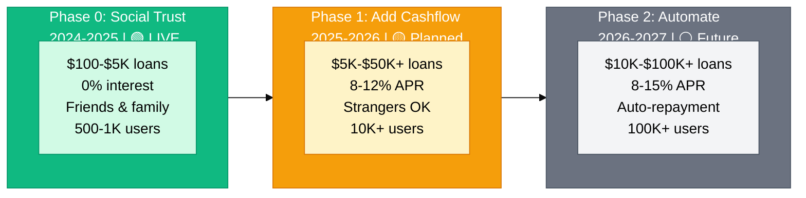

# Vision & Roadmap

→ **For complete vision and strategy:** [lendfriend.org/vision](https://lendfriend.org/vision)

This section provides technical implementation documentation for our three-phase evolution from social trust to automated, scalable uncollateralized lending infrastructure.

---

## The Three-Phase Journey

---

## Phase Documentation

### 🤝 Phase 0: Prove Trust Works (2024-2025)

**Status:** 🟢 Live on Base Sepolia Testnet

Zero-interest loans ($100-$5K) backed by social trust to prove reputation can replace collateral.

**Key Components:** Smart contracts, Farcaster social graph, Adamic-Adar trust scoring

**Goal:** 500-1,000 users, 90%+ repayment rate

→ [Phase 0 Technical Implementation](vision/phase-0-social-trust.md)

---

### 💰 Phase 1: Scale with Cashflow (2025-2026)

**Status:** 🟡 Planned

Larger loans ($5K-$50K+) combining social trust + cashflow verification from Plaid/Square/Shopify.

**Key Components:** Cashflow APIs, liquidity pools, 8-12% APR, hybrid risk scoring

**Goal:** 10K+ users, $1M+ originated, prove crypto lending scales

→ [Phase 1 Technical Implementation](vision/phase-1-cashflow.md)

---

### ⚡ Phase 2: Automate Repayment (2026-2027)

**Status:** ⚪ Future

Loans that repay themselves automatically from wallets (ERC-4337) or merchant revenue (Square/Shopify).

**Key Components:** Smart wallet plugins, merchant OAuth, auto-deduction (2-5% of sales)

**Goal:** 50%+ auto-repayment adoption, 30% lower defaults, 100K+ users

→ [Phase 2 Technical Implementation](vision/phase-2-automation.md)

---

## Risk Model Evolution

| Component | Phase 0 | Phase 1 | Phase 2 |
|-----------|:-------:|:-------:|:-------:|
| **Social Trust** | 60% | 30% | 15% |
| **Cashflow Verification** | 0% | 30% | 40% |
| **Repayment History** | 30% | 30% | 40% |
| **Loan Size Risk** | 10% | 10% | 5% |

**Evolution:** Social trust decreases as primary signal (60% → 15%), while cashflow verification is added and becomes dominant (0% → 40%). Repayment history remains consistent and grows with scale.

---

## Technical Constraints by Phase

| Constraint | Phase 0 | Phase 1 | Phase 2 |
|------------|---------|---------|---------|
| **Interest** | 0% (hardcoded) | 0-8% variable | 0-15% variable |
| **Loan Size** | $100-$5K | $5K-$50K+ | $10K-$100K+ |
| **Repayment** | Manual, single maturity | Manual, installments | Auto-deduction |
| **Identity** | Farcaster only | Farcaster + Bluesky | Multi-platform |
| **Verification** | Social trust only | Social + cashflow | Cashflow primary |
| **Liquidity** | Direct P2P | Pools + P2P | Pools only |

---

## Infrastructure Readiness

| Technology | Status | Used In |
|------------|--------|---------|
| **🟢 Ready Today** | | |
| Farcaster API (Neynar) | ✅ Production | Phase 0, 1, 2 |
| Base L2 ($0.01 txs) | ✅ Production | Phase 0, 1, 2 |
| USDC stablecoin | ✅ Production | Phase 0, 1, 2 |
| Plaid API (bank data) | ✅ Production | Phase 1, 2 |
| Square API (merchant) | ✅ Production | Phase 1, 2 |
| **🟡 Maturing 2025-26** | | |
| ERC-4337 (smart wallets) | 🔨 Early adoption | Phase 2 |
| Payment stream plugins | 🔨 Standards forming | Phase 2 |
| Shopify crypto wallets | 🔨 In development | Phase 2 |
| **⚪ Future 2026+** | | |
| zkTLS proofs | 📋 Research | Phase 3+ |
| On-chain credit scores | 📋 Design | Phase 3+ |
| Multi-chain expansion | 📋 Planned | Phase 3+ |

---

## Related Documentation

**For non-technical overview:**
- [Vision & roadmap](https://lendfriend.org/vision) — High-level strategy for investors/community
- [How it works](https://lendfriend.org/how-it-works) — User-friendly explanation
- [Whitepaper](https://lendfriend.org/whitepaper) — Complete manifesto

**Technical deep dives:**
- [Smart Contract Flow](how-it-works/smart-contract-flow.md)
- [Social Trust Scoring](how-it-works/social-trust-scoring/README.md)
- [Risk Scoring](how-it-works/risk-scoring/README.md)
- [Technical Stack](how-it-works/technical-stack.md)

**Research foundation:**
- [Research Foundation](references.md) — 80+ citations and peer-reviewed papers
- [Motivation](motivation.md) — Why uncollateralized lending matters
