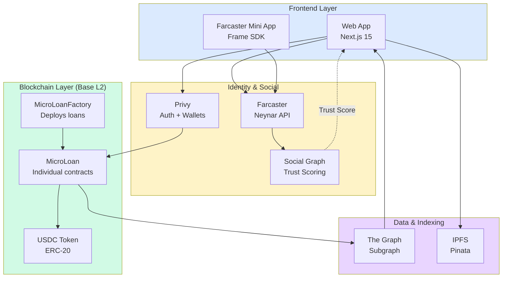

# Vision & Roadmap

→ **For complete vision and strategy:** [lendfriend.org/vision](https://lendfriend.org/vision)

This section provides technical implementation documentation for our three-phase evolution from social trust to automated, scalable uncollateralized lending infrastructure.

---

## Technical Architecture

---

## Phase Documentation

### Phase 0: Prove Trust Works (2024-2025)

**Status:** Live on Base Sepolia Testnet

**Focus:** Zero-interest loans ($100-$5K) backed by social trust signals

**Key Components:**
- Smart contracts (MicroLoan.sol, MicroLoanFactory.sol)
- Farcaster social graph integration (Neynar API)
- Trust scoring algorithm (Adamic-Adar weighted)
- Base L2 deployment with The Graph indexing

**Goal:** 500-1,000 users demonstrating 90%+ repayment rate to prove social accountability can replace collateral.

→ [Phase 0 Technical Implementation](vision/phase-0-social-trust.md)

---

### Phase 1: Scale with Cashflow (2025-2026)

**Status:** Planned

**Focus:** Larger loans ($5K-$50K+) using hybrid social + cashflow underwriting

**Key Components:**
- Cashflow verification APIs (Plaid for banks, Square/Shopify for merchants)
- Liquidity pool smart contracts for passive lending
- Interest calculation (0-8% APR based on risk)
- Hybrid risk scoring (social trust + verified cashflow + repayment history)

**Goal:** Serve borrowers traditional finance excludes—freelancers, crypto-native workers, small merchants.

→ [Phase 1 Technical Implementation](vision/phase-1-cashflow.md)

---

### Phase 2: Automate Repayment (2026-2027)

**Status:** Future

**Focus:** Loans that repay themselves automatically from wallets or business revenue

**Key Components:**
- ERC-4337 account abstraction for smart wallet auto-deduction
- Merchant OAuth and revenue-based repayment (Square/Shopify APIs)
- Payment stream plugins for programmable wallets
- Automated repayment logic (2-5% of daily sales or 10% of incoming transfers)

**Goal:** Remove repayment friction entirely—borrowers never miss payments, lenders get predictable returns.

→ [Phase 2 Technical Implementation](vision/phase-2-automation.md)

---

## Evolution: Risk Model by Phase

| Phase | Social Trust | Cashflow | Repayment History | Loan Size | Rationale |
|-------|-------------|----------|-------------------|-----------|-----------|
| **Phase 0** | 60% | 0% | 30% | 10% | Test pure social accountability |
| **Phase 1** | 30% | 30% | 30% | 10% | Add objective data as loans scale |
| **Phase 2** | 15% | 40% | 40% | 5% | Prioritize verifiable cashflow and track record |

---

## Technical Constraints by Phase

| Constraint | Phase 0 | Phase 1 | Phase 2 |
|------------|---------|---------|---------|
| **Interest** | 0% (hardcoded) | 0-8% variable | 0-15% variable |
| **Loan Size** | $100-$5K | $5K-$50K+ | $10K-$100K+ |
| **Repayment** | Manual, single maturity | Manual, installments | Auto-deduction |
| **Identity** | Farcaster only | Farcaster + Bluesky | Multi-platform |
| **Verification** | Social trust only | Social + cashflow | Cashflow primary |
| **Liquidity** | Direct P2P | Pools + P2P | Pools only |

---

## Infrastructure Readiness

**Available Today:**
- Farcaster API (social graph with Neynar)
- Base L2 ($0.01 transactions)
- USDC stablecoin (ERC-20)
- Plaid API (bank account data)
- Square API (merchant sales data)

**Maturing 2025-2026:**
- Account Abstraction (ERC-4337)
- Payment stream plugins
- Shopify crypto wallets

**Future 2026+:**
- zkTLS proofs for privacy
- Portable on-chain credit scores
- Multi-chain expansion

---

## Related Documentation

**For non-technical overview:**
- [Vision & roadmap](https://lendfriend.org/vision) — High-level strategy for investors/community
- [How it works](https://lendfriend.org/how-it-works) — User-friendly explanation
- [Whitepaper](https://lendfriend.org/whitepaper) — Complete manifesto

**Technical deep dives:**
- [Smart Contract Flow](how-it-works/smart-contract-flow.md)
- [Social Trust Scoring](how-it-works/social-trust-scoring/README.md)
- [Risk Scoring](how-it-works/risk-scoring/README.md)
- [Technical Stack](how-it-works/technical-stack.md)

**Research foundation:**
- [Academic Research](references.md) — 30+ peer-reviewed papers
- [Motivation](motivation.md) — Why uncollateralized lending matters
