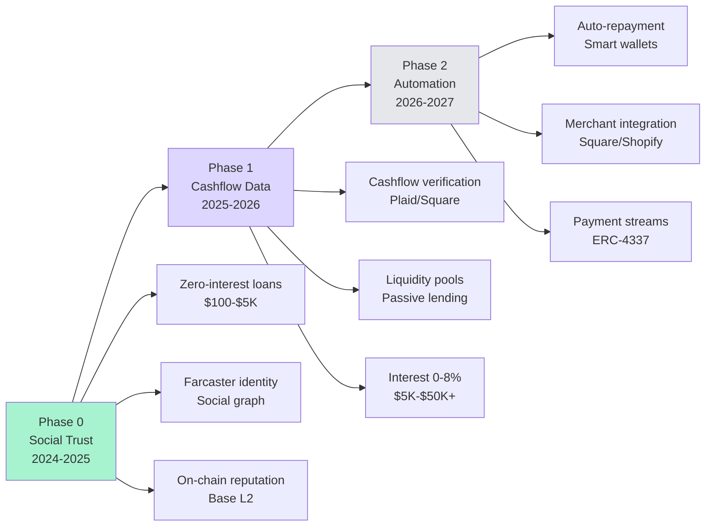
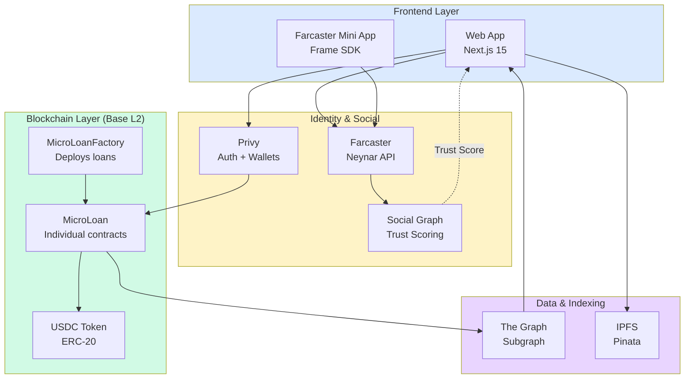
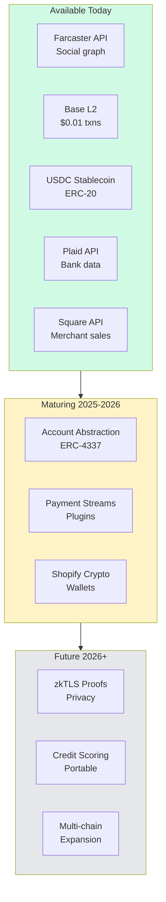
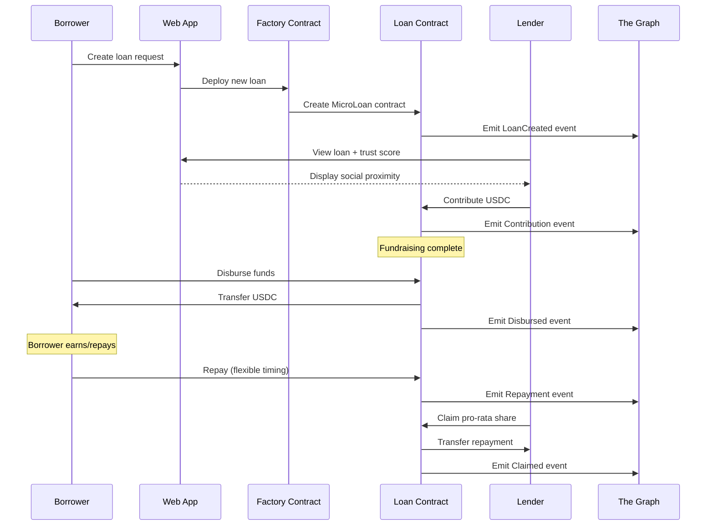

# Vision & Roadmap

→ **For complete vision and strategy:** [lendfriend.org/vision](https://lendfriend.org/vision)

This section provides technical implementation documentation for our three-phase evolution from social trust to automated, scalable uncollateralized lending infrastructure.

---

## Three-Phase Technical Evolution

---

## Technical Architecture Overview

---

## Phase Documentation

### Phase 0: Prove Trust Works

**Focus:** Zero-interest loans backed by social trust signals

**Key Technical Components:**
- Smart contracts (MicroLoan.sol, MicroLoanFactory.sol)
- Farcaster social graph integration
- Trust scoring algorithm (Adamic-Adar weighted)
- Base L2 deployment
- The Graph subgraph indexing

→ [Phase 0 Technical Implementation](vision/phase-0-social-trust.md)

---

### Phase 1: Scale with Cashflow

**Focus:** Hybrid underwriting with cashflow verification

**Key Technical Components:**
- Plaid API integration (bank accounts)
- Square/Shopify API integration (merchant revenue)
- Liquidity pool smart contracts
- Interest calculation and accrual
- Hybrid risk scoring model

→ [Phase 1 Technical Implementation](vision/phase-1-cashflow.md)

---

### Phase 2: Automate Repayment

**Focus:** Programmable repayment automation

**Key Technical Components:**
- ERC-4337 account abstraction
- Payment stream plugins
- Merchant OAuth and auto-deduction
- Revenue-based repayment logic
- Smart wallet integrations

→ [Phase 2 Technical Implementation](vision/phase-2-automation.md)

---

## Risk Model Evolution

```mermaid
graph LR
    subgraph Phase0["Phase 0: Pure Social Trust"]
        S0[Social Trust 60%]
        R0[Repayment History 30%]
        L0[Loan Size 10%]
    end

    subgraph Phase1["Phase 1: Hybrid Model"]
        S1[Social Trust 30%]
        C1[Cashflow 30%]
        R1[Repayment History 30%]
        L1[Loan Size 10%]
    end

    subgraph Phase2["Phase 2: Data-Driven"]
        C2[Cashflow 40%]
        R2[Repayment History 40%]
        S2[Social Trust 15%]
        L2[Loan Size 5%]
    end

    Phase0 --> Phase1
    Phase1 --> Phase2

    style Phase0 fill:#a7f3d0
    style Phase1 fill:#ddd6fe
    style Phase2 fill:#e5e7eb
```

**Evolution rationale:**
- **Phase 0:** Test pure social accountability
- **Phase 1:** Add objective data as loans scale
- **Phase 2:** Prioritize verifiable cashflow and track record

---

## Infrastructure Readiness

---

## Data Flow: Loan Lifecycle

---

## Technical Constraints by Phase

| Constraint | Phase 0 | Phase 1 | Phase 2 |
|------------|---------|---------|---------|
| **Interest** | 0% (hardcoded) | 0-8% variable | 0-15% variable |
| **Loan Size** | $100-$5K | $5K-$50K+ | $10K-$100K+ |
| **Repayment** | Manual, single maturity | Manual, installments | Auto-deduction |
| **Identity** | Farcaster only | Farcaster + Bluesky | Multi-platform |
| **Verification** | Social trust only | Social + cashflow | Cashflow primary |
| **Liquidity** | Direct P2P | Pools + P2P | Pools only |

---

## Related Documentation

**For non-technical overview:**
- [Vision & roadmap](https://lendfriend.org/vision) — High-level strategy
- [How it works](https://lendfriend.org/how-it-works) — User-friendly explanation
- [Whitepaper](https://lendfriend.org/whitepaper) — Complete manifesto

**Technical deep dives:**
- [Smart Contract Flow](how-it-works/smart-contract-flow.md)
- [Social Trust Scoring](how-it-works/social-trust-scoring/README.md)
- [Risk Scoring](how-it-works/risk-scoring/README.md)
- [Technical Stack](how-it-works/technical-stack.md)

**Research foundation:**
- [Academic Research](references.md) — 30+ peer-reviewed papers
- [Motivation](motivation.md) — Why uncollateralized lending matters
