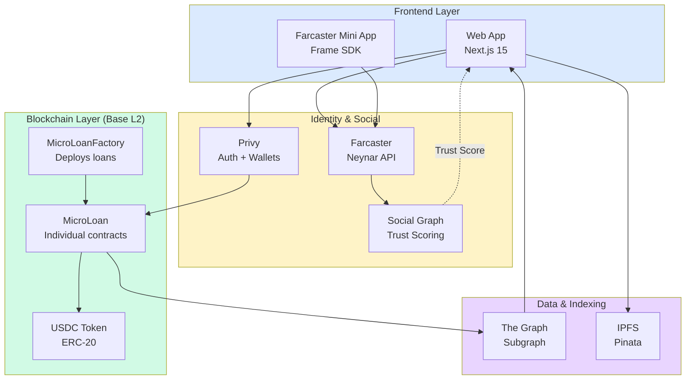

# Phase 0: Technical Implementation

**Status:** Live on Base Sepolia Testnet
**Timeline:** 2024-2025
**Network:** Base Sepolia (Chain ID: 84532)

---


**For High-Level Overview**

This page contains technical implementation details for Phase 0.

For vision, goals, and roadmap → [lendfriend.org/vision](https://lendfriend.org/vision)


---

## Overview

Phase 0 tests zero-interest microloans ($100-$5K) backed by social trust signals from Farcaster.

**Core hypothesis:** Reputation-based lending can achieve 90%+ repayment without collateral or interest.

**Technical focus:** Building foundational smart contracts, social graph integration, and data collection infrastructure.

---

## System Architecture



**Four-layer architecture:**
- **Frontend:** Web app and Farcaster mini app for user interaction
- **Identity & Social:** Farcaster integration for social graph and trust scoring
- **Blockchain:** Smart contracts on Base L2 for loan management
- **Data:** The Graph for indexing, IPFS for metadata storage

---

## Smart Contract Architecture

### Deployed Contracts (Base Sepolia)

| Contract | Address | Lines | Purpose |
|----------|---------|-------|---------|
| **MicroLoanFactory** | `0x747988...bFff` | 146 | Loan contract deployment and policy |
| **MicroLoan** (template) | - | 416 | Zero-interest, single-maturity lending |
| **TestUSDC** | `0x2d04a1...aaFe` | - | Sepolia testnet token with faucet |

→ [View contracts on GitHub](https://github.com/...)

---

### MicroLoan.sol

**Contract model:** Individual loan contracts deployed via factory pattern

**Key features:**
- Zero-interest hardcoded (1.0x repayment multiplier)
- Single maturity date (no installments)
- Flexible repayment (any amount, anytime before or after maturity)
- Accumulator-based distribution for gas-efficient claims
- On-chain default recording if unpaid at maturity
- Overpayment distribution to lenders as bonus
- Refund mechanism if fundraising goal not met

**State variables:**

```solidity
address public immutable borrower;
address public immutable token;  // USDC
uint256 public immutable principal;
uint256 public immutable maturityDate;
uint256 public totalRaised;
uint256 public totalRepaid;
uint256 public accumulator;  // For pro-rata distribution
mapping(address => uint256) public contributions;
mapping(address => uint256) public claimed;
```

**Core functions:**

```solidity
function contribute(uint256 amount) external
function disburse() external
function repay(uint256 amount) external
function claimableAmount(address contributor) public view returns (uint256)
function claim() external
```

**Gas optimization:** Accumulator pattern enables O(1) repayment distribution instead of O(n) iteration over lenders.

→ [Complete contract reference](../developers/contract-api.md)

---

### MicroLoanFactory.sol

**Purpose:** Deploys and manages individual loan contracts

**Policy constraints:**
- Minimum principal: $100 USDC
- Loan duration: 7-365 days
- One active loan per borrower
- Pausable for emergency controls

**Key functions:**

```solidity
function createLoan(
    address borrower,
    string calldata metadataURI,
    uint256 principal,
    uint256 loanDuration,
    uint256 fundraisingDeadline
) external returns (address loanAddress)
```

**Events emitted:**

```solidity
event LoanCreated(
    address indexed loanAddress,
    address indexed borrower,
    uint256 principal,
    uint256 maturityDate
);
```

---

## Social Trust Scoring Implementation

→ **Algorithm overview:** [lendfriend.org/how-it-works](https://lendfriend.org/how-it-works#trust-score-algorithm)

→ **Research foundation:** [Academic papers](../references.md)

### Technical Architecture

**Computation:** Off-chain (too expensive for on-chain social graph analysis)

**Data source:** Farcaster social graph via Neynar API

**Caching:** 30-minute TTL via React Query

**Algorithm:** Adamic-Adar weighted mutual connections

### Implementation

```typescript
interface TrustScoreInput {
  borrowerFid: number;
  lenderFid: number;
}

interface TrustScoreOutput {
  mutualConnections: number;
  effectiveMutuals: number;      // Adamic-Adar weighted
  socialDistance: number;         // 0-100
  riskTier: 'LOW' | 'MEDIUM' | 'HIGH';
}

async function calculateTrustScore(
  input: TrustScoreInput
): Promise<TrustScoreOutput>
```

**Scoring formula:**

```
S_base = f(M_effective)           // 0-60 points based on weighted mutuals
S_overlap = (M / min(|B|, |L|)) × 30   // 0-30 points network overlap
S_mutual = follows_both ? 10 : 5       // 0-10 points mutual follow

S_total = min(S_base + S_overlap + S_mutual, 100)
```

**Risk tier classification:**

```typescript
if (effectiveMutuals >= 9 || socialDistance >= 60) return 'LOW';
if (effectiveMutuals >= 2.5 || socialDistance >= 30) return 'MEDIUM';
return 'HIGH';
```

**Data flow:**

1. User connects Farcaster account (Privy auth)
2. Frontend fetches social graph (Neynar API)
3. Calculate trust scores for borrower-lender pairs
4. Display in UI (not stored on-chain)
5. Cache results for 30 minutes

→ [Complete algorithm details](../how-it-works/social-trust-scoring/the-algorithm.md)

### Platform Integration

**Farcaster (Primary)**

**API:** Neynar REST API
**Authentication:** Privy embedded wallet + Farcaster sign-in
**Data accessed:**
- User FID (Farcaster ID)
- Follower/following graph
- Neynar quality score (0-1 spam filter)
- Power Badge status (verified accounts)
- Cast history and engagement

**Trust signals:**
- Mutual connections (weighted by rarity)
- Power Badge verification (boolean)
- Neynar quality score (filters bots)
- Account age (via FID creation date)
- On-chain wallet history (linked address)

**Implementation:**

```typescript
interface FarcasterUser {
  fid: number;
  username: string;
  displayName: string;
  pfp: string;
  verifications: string[];  // Linked wallet addresses
  followerCount: number;
  followingCount: number;
}

// Fetch social graph
const followData = await neynar.fetchBulkUsers(fids);
const mutualConnections = intersection(
  borrower.following,
  lender.following
);
```

→ [Farcaster integration guide](../developers/farcaster-integration.md)

**Bluesky (Future)**

Integration status: Planned for 2026
- AT Protocol decentralized identity
- Domain verification (handle = domain)
- Account quality scoring (similar to Neynar)

→ [Platform expansion strategy](https://lendfriend.org/vision#platform-expansion)

---

## Frontend Applications

### Web App

**Stack:** Next.js 15, React 19, TypeScript
**Styling:** Tailwind CSS
**State:** React Query, Zustand
**Web3:** wagmi v2, viem
**Auth:** Privy (wallet + social login)

**Key pages:**
- `/` — Loan discovery and list
- `/create-loan` — Multi-step loan creation form
- `/loan/[address]` — Loan detail and funding
- `/portfolio` — Lender's funding dashboard
- `/my-loans` — Borrower's loan management

**Payment methods:**
- USDC direct (wallet connect)
- Coinbase Pay (card-to-crypto)
- Privy fiat onramp
- Gasless approvals (ERC-4337 via Pimlico)

**Key features:**
- Trust score display (real-time calculation)
- Social sharing (12+ platforms)
- IPFS metadata upload
- Transaction history

→ [Frontend integration guide](../developers/frontend-integration.md)

---

### Farcaster Mini App

**Stack:** Next.js 15, @farcaster/frame-sdk
**Deployment:** Vercel edge functions
**Network:** Base Sepolia

**Features:**
- Native mini app (runs inside Farcaster)
- Tab-based mobile interface
- Create/fund loans without leaving app
- Automatic FID lookup
- Cast Actions for one-tap contributions

→ [Farcaster mini app guide](../developers/farcaster-miniapp.md)

---

## Data Infrastructure

### The Graph Subgraph

**Subgraph ID:** `lendfriend-base-sepolia`
**Network:** Base Sepolia
**Indexing:** Real-time loan events

**Entities indexed:**

```graphql
type Loan @entity {
  id: ID!
  borrower: Bytes!
  principal: BigInt!
  totalRaised: BigInt!
  totalRepaid: BigInt!
  maturityDate: BigInt!
  createdAt: BigInt!
  status: LoanStatus!
  contributions: [Contribution!]! @derivedFrom(field: "loan")
}

type Contribution @entity {
  id: ID!
  loan: Loan!
  lender: Bytes!
  amount: BigInt!
  timestamp: BigInt!
}
```

**Queries:**

```graphql
# Get all loans for a borrower
{
  loans(where: { borrower: "0x..." }) {
    id
    principal
    totalRaised
    maturityDate
  }
}

# Get lender's contributions
{
  contributions(where: { lender: "0x..." }) {
    loan { id }
    amount
    timestamp
  }
}
```

→ [Subgraph schema](../developers/subgraph.md)

---

### IPFS Metadata Storage

**Provider:** Pinata
**Storage:** Immutable loan metadata

**Metadata schema:**

```typescript
interface LoanMetadata {
  title: string;
  description: string;
  images?: string[];
  budgetBreakdown?: {
    category: string;
    amount: number;
  }[];
  borrowerInfo: {
    fid: number;
    username: string;
  };
  createdAt: number;
}
```

**Upload flow:**

1. User submits loan form
2. Frontend uploads images to IPFS
3. Metadata JSON uploaded to IPFS
4. IPFS CID stored in loan contract (`metadataURI`)

→ [IPFS integration guide](../developers/ipfs.md)

---

## Data Collection

Phase 0 is designed for behavioral data gathering.

**On-chain data tracked:**
- Loan creation events
- Contribution amounts and timestamps
- Repayment amounts and timing
- Default status at maturity
- Lender claim patterns

**Off-chain data tracked:**
- Trust scores at time of loan creation
- Social graph snapshots
- User acquisition sources
- Funding completion time
- Share/viral metrics

**Analytics queries:**

```typescript
// Example: Analyze repayment correlation with trust scores
SELECT
  trust_score_bucket,
  AVG(repayment_ratio) as avg_repayment,
  COUNT(*) as loan_count
FROM loans
WHERE maturity_date < NOW()
GROUP BY trust_score_bucket
```

→ [Research methodology](../research/methodology.md)

---

## Technical Constraints

**Phase 0 design decisions:**

| Constraint | Rationale |
|-----------|-----------|
| **Zero interest** | Simplifies contracts, tests pure social accountability |
| **Single maturity** | No installment logic, simpler state management |
| **Farcaster only** | Highest quality trust signals, smaller attack surface |
| **No cashflow verification** | Focus on social trust primitive first |
| **Manual repayment** | Tests if reputation incentive is sufficient |

These constraints are intentional. Phase 1 will add cashflow verification and interest for larger loans.

→ [Vision & roadmap](https://lendfriend.org/vision)

---

## Next Phase

→ [Phase 1: Scale with Cashflow](phase-1-cashflow.md)

**New technical capabilities:**
- Cashflow verification APIs (Plaid, Square, Shopify)
- Liquidity pool smart contracts
- Interest calculation and accrual
- Hybrid risk scoring (social + financial signals)

**Prerequisites for Phase 1:**
- 100+ completed loans
- 3-6 months of repayment data
- Validated trust score correlation with repayment
- Proven 85%+ repayment rate

---

## Related Documentation

**High-level context:**
- [Vision & roadmap](https://lendfriend.org/vision) — The future we're building
- [How it works](https://lendfriend.org/how-it-works) — User-friendly algorithm explanation
- [Whitepaper](https://lendfriend.org/whitepaper) — Full manifesto and research

**Technical deep dives:**
- [Social Trust Scoring](../how-it-works/social-trust-scoring/README.md) — Algorithm calibration
- [Smart Contract Reference](../developers/contract-api.md) — Complete API documentation
- [Academic Research](../references.md) — 30+ peer-reviewed papers
