# Phase 0: Prove Trust Works

**Status:** Live on Base Sepolia Testnet
**Timeline:** 2024-2025
**Network:** Base Sepolia (Chain ID: 84532)

---

## Overview

Zero-interest microloans ($100-$5K) backed by social trust signals from Farcaster.

**Core hypothesis:** Social trust signals provide useful underwriting data for uncollateralized lending.[[9]](../references.md#ref9)[[19]](../references.md#ref19)

**Goal:** Gather behavioral data to inform Phase 1 risk models.

**Network:** Base Sepolia testnet, mainnet planned for Q1 2025

→ [Technical stack](../how-it-works/technical-stack.md) | [Smart contract flow](../how-it-works/smart-contract-flow.md)

---

## How It Works

**Social Trust Scoring:**[[2]](../references.md#ref2)
- Algorithm: Adamic-Adar weighted mutual connections
- Data: Farcaster social graph, Power Badge status, account quality
- → [Trust scoring details](../how-it-works/social-trust-scoring/README.md)

**Risk Model (initial weights):**
- 60% Social Trust Score
- 30% Repayment History
- 10% Loan Size Risk

These weights will be refined as we collect repayment data to optimize prediction accuracy.

→ [Risk scoring methodology](../how-it-works/risk-scoring/README.md)

---

## Loan Lifecycle

```mermaid
%%{init: {'theme':'base', 'themeVariables': {'primaryColor':'#3B9B7F','primaryTextColor':'#fff','primaryBorderColor':'#2E7D68','lineColor':'#3B9B7F','fontSize':'14px'}}}%%
graph LR
    A[👤 CREATE<br/>Connect Farcaster<br/>Request $2,000<br/>30-day term<br/>0% interest] --> B[🔗 SHARE<br/>Share on socials<br/>Trust score visible<br/>12+ platforms]
    B --> C[💰 FUND<br/>Lenders contribute<br/>See trust score<br/>Direct P2P]
    C --> D[✅ RECEIVE<br/>Funds released<br/>Auto to wallet<br/>Smart contract]
    D --> E[📅 REPAY<br/>Before maturity<br/>Manual payment<br/>7-day grace]
    E --> F[⭐ COMPLETE<br/>On-chain history<br/>Trust increases<br/>Future loans]
    E -.-> G[🚫 DEFAULT<br/>Permanent record<br/>Reputation damage<br/>No future loans]

    style A fill:#3B9B7F,stroke:#2E7D68,color:#fff
    style B fill:#3B9B7F,stroke:#2E7D68,color:#fff
    style C fill:#3B9B7F,stroke:#2E7D68,color:#fff
    style D fill:#3B9B7F,stroke:#2E7D68,color:#fff
    style E fill:#F59E0B,stroke:#D97706,color:#fff
    style F fill:#10B981,stroke:#059669,color:#fff
    style G fill:#EF4444,stroke:#DC2626,color:#fff
```

**Borrowers:** Create loan with Farcaster identity, share across platforms, receive funds when funded, repay before maturity (7-day grace).

**Lenders:** Discover loans through social connections, see trust scores, contribute directly, track repayment on-chain.

**Defaults:** Unpaid loans after grace period create permanent on-chain records, making borrowers ineligible for future loans.

→ [How it works](../how-it-works/overview.md) | [Virality mechanics](../how-it-works/virality-and-growth/README.md)

---

## Design Constraints

Intentional constraints to test social trust primitive:
- **Zero interest** — Tests pure social accountability
- **Single maturity** — Simpler state management
- **Starts with Farcaster** — Highest quality trust signals (may expand based on growth)
- **No cashflow verification** — Focus on social trust first
- **Manual repayment** — Tests reputation incentive

---

## What We're Learning

Phase 0 gathers behavioral data to validate the social trust hypothesis and inform Phase 1:
- Correlation between trust scores and repayment
- Timing patterns and amounts
- User acquisition and viral sharing
- Community dynamics

Phase 1 begins once we have sufficient data to refine risk models—Phase 0 is about learning and iteration.

---

## Next: Phase 1

→ [Phase 1: Scale with Cashflow](phase-1-cashflow.md)

Adds cashflow verification (Plaid, Square, Shopify), liquidity pools, interest rates (8-12% APR), and hybrid risk scoring.
