```mermaid
%%{init: {'theme':'base', 'themeVariables': {'primaryColor':'#3B9B7F','primaryTextColor':'#fff','primaryBorderColor':'#2E7D68','lineColor':'#3B9B7F','fontSize':'14px'}}}%%
graph LR
    A[👤 CREATE<br/>Connect Farcaster<br/>Request $2,000<br/>30-day term<br/>0% interest] --> B[🔗 SHARE<br/>Share on socials<br/>Trust score visible<br/>12+ platforms]
    B --> C[💰 FUND<br/>Lenders contribute<br/>See trust score<br/>Direct P2P]
    C --> D[✅ RECEIVE<br/>Funds released<br/>Auto to wallet<br/>Smart contract]
    D --> E[📅 REPAY<br/>Before maturity<br/>Manual payment<br/>7-day grace]
    E --> F[⭐ COMPLETE<br/>On-chain history<br/>Trust increases<br/>Future loans]
    E -.-> G[🚫 DEFAULT<br/>Permanent record<br/>Reputation damage<br/>No future loans]

    style A fill:#3B9B7F,stroke:#2E7D68,color:#fff
    style B fill:#3B9B7F,stroke:#2E7D68,color:#fff
    style C fill:#3B9B7F,stroke:#2E7D68,color:#fff
    style D fill:#3B9B7F,stroke:#2E7D68,color:#fff
    style E fill:#F59E0B,stroke:#D97706,color:#fff
    style F fill:#10B981,stroke:#059669,color:#fff
    style G fill:#EF4444,stroke:#DC2626,color:#fff
```

# Phase 0: Prove Trust Works

**Status:** Live on Base Sepolia Testnet
**Timeline:** 2024-2025
**Network:** Base Sepolia (Chain ID: 84532)

---

## Overview

Phase 0 launches zero-interest microloans ($100-$5K) backed by social trust signals from Farcaster.

**Core hypothesis:** Social trust signals provide useful underwriting data for uncollateralized lending.[[9]](../references.md#ref9)[[19]](../references.md#ref19)

**Goal:** Launch product, reduce friction, gather real-world behavioral data to inform Phase 1 risk models.

→ [Why uncollateralized lending matters](../motivation.md)

---

## System Architecture

Phase 0 implements the core LendFriend protocol on Base L2 with Farcaster identity integration.

→ [Complete technical stack](../how-it-works/technical-stack.md) | [System overview](../how-it-works/overview.md)

**Key components:**
- **Frontend:** Next.js 15 web app + Farcaster Mini App
- **Identity:** Farcaster (via Neynar API) + Privy wallet auth
- **Blockchain:** Base L2 with MicroLoan smart contracts
- **Data:** The Graph subgraph + IPFS metadata storage

---

## Smart Contracts

### Deployed Contracts (Base Sepolia)

| Contract | Address | Purpose |
|----------|---------|---------|
| **MicroLoanFactory** | `0x747988...bFff` | Loan contract deployment and policy |
| **MicroLoan** (template) | Individual contracts | Zero-interest, single-maturity lending |
| **TestUSDC** | `0x2d04a1...aaFe` | Sepolia testnet token with faucet |

**Mainnet deployment:** Planned for Q1 2025 after testnet validation

→ [Smart contract flow and lifecycle](../how-it-works/smart-contract-flow.md)

---

## Social Trust Scoring

Phase 0 uses social trust as the primary underwriting signal. Trust scores are calculated off-chain using Farcaster social graph data.

**Algorithm:** Adamic-Adar weighted mutual connections[[2]](../references.md#ref2)

→ [Trust scoring algorithm](../how-it-works/social-trust-scoring/the-algorithm.md) | [Implementation details](../how-it-works/social-trust-scoring/implementation.md) | [Sybil resistance](../how-it-works/social-trust-scoring/sybil-resistance.md)

**Data sources:**
- Mutual connections between borrower and lenders
- Farcaster Power Badge status
- Neynar quality scores
- Account age and activity

→ [Complete social trust scoring documentation](../how-it-works/social-trust-scoring/README.md)

---

## Risk Assessment

Risk scoring in Phase 0 is simplified to focus on social signals:

- **60%** Social Trust Score
- **30%** Repayment History (from past loans)
- **10%** Loan Size Risk

→ [Risk scoring methodology](../how-it-works/risk-scoring/README.md) | [Risk calculation](../how-it-works/risk-scoring/calculation.md) | [Risk grades and tiers](../how-it-works/risk-scoring/risk-grades.md)

---

## User Experience

### Loan Lifecycle

### For Borrowers

- Create loan with Farcaster identity
- Share loan link across social platforms (12+ platforms)
- Receive funds automatically when fully funded
- Repay before maturity date (7-day grace period)

→ [Borrower profiles and identity](../how-it-works/borrower-profiles.md)

### For Lenders

- Discover loans through social connections
- See trust score before contributing
- Earn 0% interest (Phase 0), building reputation for future phases
- Track repayment on-chain

→ [Virality and growth mechanics](../how-it-works/virality-and-growth/README.md) | [Farcaster virality](../how-it-works/virality-and-growth/farcaster-virality.md)

---

## Default Handling

Phase 0 tracks defaults on-chain but does not enforce liquidation (no collateral).

**Default definition:** Loan unpaid at maturity date + 7 day grace period

**Consequences:**
- On-chain default record (permanent reputation damage)
- Ineligible for future loans
- Social accountability via Farcaster network

→ [Risk and default handling](../how-it-works/risk-and-defaults.md) | [Lender warnings](../how-it-works/risk-scoring/lender-warnings.md)

---

## Phase 0 Technical Constraints

These constraints are intentional design decisions:

| Constraint | Rationale |
|-----------|-----------|
| **Zero interest** | Simplifies contracts, tests pure social accountability |
| **Single maturity** | No installment logic, simpler state management |
| **Farcaster only** | Highest quality trust signals, smaller attack surface |
| **No cashflow verification** | Focus on social trust primitive first |
| **Manual repayment** | Tests if reputation incentive is sufficient |

→ Phase 1 will add cashflow verification, interest rates, and liquidity pools

---

## Data Collection

Phase 0 is designed for behavioral data gathering to validate the social trust hypothesis.

**On-chain data:**
- Loan creation, contributions, repayments, defaults
- Timing patterns and amounts

**Off-chain data:**
- Trust scores at loan creation
- Social graph snapshots
- User acquisition sources
- Viral sharing metrics

**Purpose:** Analyze correlation between social trust scores and repayment behavior to refine risk model for Phase 1.

---

## Prerequisites for Phase 1

Before moving to Phase 1 (cashflow-based lending):

- ✅ Product launched and stable
- ✅ Sufficient loan data collected (ideally 50+ loans)
- ✅ Trust score and repayment patterns analyzed
- ✅ User feedback incorporated
- ✅ Mainnet deployment complete

Phase 1 will begin once we have enough data to refine risk models, regardless of specific metrics. Phase 0 is about learning and iteration.

---

## Next Phase

→ [Phase 1: Scale with Cashflow](phase-1-cashflow.md)

**New capabilities:**
- Cashflow verification (Plaid, Square, Shopify)
- Liquidity pools for passive lending
- Interest rates (0-8% APR)
- Hybrid risk scoring (social + financial)

---

## Related Documentation

**Complete technical documentation:**
- [How It Works - Overview](../how-it-works/overview.md)
- [Smart Contract Flow](../how-it-works/smart-contract-flow.md)
- [Technical Stack](../how-it-works/technical-stack.md)
- [Social Trust Scoring](../how-it-works/social-trust-scoring/README.md)
- [Risk Scoring](../how-it-works/risk-scoring/README.md)

**Research and context:**
- [Research Foundation](../references.md) — 80+ citations and peer-reviewed papers
- [Motivation](../motivation.md) — Why this matters
- [Whitepaper](https://lendfriend.org/whitepaper) — Complete manifesto
