# Phase 1: Scale with Cashflow

**Status:** Planned
**Timeline:** 2025-2026
**Prerequisites:** Phase 0 success (100+ loans, 3-6 months repayment data, 85%+ repayment rate)

---


**For High-Level Overview**

For complete vision and strategy → [lendfriend.org/vision](https://lendfriend.org/vision)


---

## What We're Building

Phase 1 scales beyond personal networks by adding **cashflow verification** to the social trust foundation from Phase 0.

**Key additions:**
- Larger loans: $5,000 - $50,000+
- Cashflow-based underwriting (not just social trust)
- Liquidity pools for passive lending
- Interest rates: 0-8% APR
- Multi-platform expansion (Bluesky)

**Goal:** Serve 10,000+ users with $1M+ in loans originated, proving hybrid trust + cashflow model works at scale.

---

## Why This Matters

### The Problem with Phase 0 Limits

Phase 0 proves social trust works for small loans, but has constraints:
- **Small loans only** ($100-$5K) → Can't serve larger needs
- **Personal networks only** → Limited to friends-of-friends
- **No interest** → Unsustainable without lender yield
- **Manual everything** → Doesn't scale

### What Phase 1 Unlocks

**Bigger loans without collateral:**
- Freelancer needs $15K for equipment
- Merchant needs $25K for inventory
- Currently: No options except predatory MCAs or rejection

**Passive capital:**
- Lenders deposit into pools, earn yield
- Don't need to review every loan manually
- Capital scales beyond personal networks

**Fair pricing:**
- 4-8% APR (vs. 60-200% for payday loans/MCAs)
- Transparent interest, no hidden fees
- Borrowers build real credit history

---

## How It Works (High Level)

### 1. Cashflow Verification

**Three income sources:**

**Bank accounts (Plaid):**
- Connect bank via OAuth
- Verify income from direct deposits
- Privacy-preserving (income ranges, not full transaction history)

**Merchant revenue (Square/Shopify):**
- Connect merchant account via OAuth
- Verify sales revenue over time
- Assess business cashflow capacity

**On-chain income (wallet analysis):**
- Analyze wallet transaction history
- Identify recurring income (DAO payments, protocol fees, NFT sales)
- Weight recurring higher than one-time

### 2. Hybrid Risk Scoring

Combine social trust (Phase 0) with financial data:

| Loan Size | Social Trust | Cashflow | Repayment History |
|-----------|--------------|----------|-------------------|
| $100-$5K | 50% | 20% | 30% |
| $5K-$25K | 30% | 40% | 30% |
| $25K-$50K+ | 15% | 50% | 35% |

**Why this works:**
- Small loans among friends → weight social trust higher
- Large loans to strangers → weight cashflow verification higher
- Past repayment history always matters

### 3. Liquidity Pools

**How Pools Work:**

```mermaid
%%{init: {'theme':'base', 'themeVariables': {'primaryColor':'#3B9B7F','primaryTextColor':'#fff','primaryBorderColor':'#2E7D68','lineColor':'#3B9B7F'}}}%%
graph TB
    subgraph Lenders["💰 LENDERS"]
        L1[Deposit USDC]
        L2[Earn Passive Yield]
        L3[Withdraw Anytime]
    end

    subgraph Pools["📊 LIQUIDITY POOLS"]
        P1["🏦 Conservative<br/>4-6% APR<br/>$100K TVL"]
        P2["💼 Balanced<br/>6-8% APR<br/>$250K TVL"]
        P3["🚀 Aggressive<br/>8-12% APR<br/>$150K TVL"]
    end

    subgraph Borrowers["👤 BORROWERS"]
        B1[Submit Application]
        B2[Risk Score: 85%]
        B3[Auto-Approved]
        B4[Receive $10K @ 8% APR]
        B5[Repay Over 12 Months]
    end

    L1 --> P1
    L1 --> P2
    L1 --> P3

    P1 --> B3
    P2 --> B3
    P3 --> B3

    B1 --> B2 --> B3 --> B4 --> B5

    B5 --> L2

    style P1 fill:#60A5FA,stroke:#3B82F6,color:#fff
    style P2 fill:#3B9B7F,stroke:#2E7D68,color:#fff
    style P3 fill:#F59E0B,stroke:#D97706,color:#fff
    style B3 fill:#10B981,stroke:#059669,color:#fff
```

**For lenders:**
- Deposit USDC into risk-stratified pools (Conservative, Balanced, Aggressive)
- Earn passive yield (4-8% APR target based on risk tolerance)
- Withdraw anytime from unallocated reserves
- Defaults spread across pool (auto-diversification)

**For borrowers:**
- Get approved based on hybrid risk score
- Receive instant loan offer (amount, rate, terms)
- Funds disbursed from pool automatically
- Repay on schedule, build on-chain credit history

**Why pools enable scale:**
- No need to find individual lenders for each loan
- Capital available 24/7 (not dependent on personal networks)
- Market-sized liquidity, not network-sized

### 4. Cross-Platform Expansion

**Bluesky integration (late 2025):**
- AT Protocol decentralized identity
- Domain verification (handle = owned domain)
- Social graph for trust scoring
- Expand beyond Farcaster-only user base

**Web platform enhancements:**
- Fiat onramps for non-crypto users (Coinbase Pay, Privy)
- Social login (Google, Twitter, email)
- Cross-platform sharing (WhatsApp, Telegram, etc.)

---

## Success Criteria

**Quantitative:**
- 10,000+ active users (10x Phase 0)
- $1M+ in loans originated
- $500K+ TVL in liquidity pools
- 70%+ pool utilization rate
- 85%+ repayment rate maintained

**Qualitative:**
- Cashflow verification predicts repayment (statistical significance)
- Hybrid model outperforms pure social trust for large loans
- Pools attract passive capital from crypto investors
- Borrowers choose LendFriend over traditional payday loans

**Key validation:** If pools reach $500K TVL with 70%+ utilization and <15% default rate, we've proven uncollateralized crypto lending can scale.

---

## What Comes After

Once Phase 1 validates the cashflow model, Phase 2 adds automated repayment:

→ [Phase 2: Automate Repayment](phase-2-automation.md)

**Key addition:** Loans that repay themselves automatically from wallet income or merchant revenue, removing all manual repayment friction.

---

## Related Documentation

**Context:**
- [Vision & Roadmap](../vision.md) — Complete three-phase strategy
- [Phase 0: Prove Trust Works](phase-0-social-trust.md) — Social trust foundation
- [Motivation](../motivation.md) — Why uncollateralized lending matters

**For investors/community:**
- [lendfriend.org/vision](https://lendfriend.org/vision) — High-level vision and goals
