# Phase 2: Automate Repayment

**Status:** Future
**Timeline:** 2026-2027
**Prerequisites:** Phase 1 validated (pools active, cashflow underwriting working, sufficient scale)

---


**For High-Level Overview**

For complete vision and strategy → [lendfriend.org/vision](https://lendfriend.org/vision)


---

## What We're Building

Phase 2 automates loan repayment, removing all manual repayment friction.

**The vision:** Loans that repay themselves automatically from your income.

**Two mechanisms:**
1. **Wallet auto-deduction** — Deduct % of incoming crypto transfers automatically
2. **Merchant revenue sharing** — Deduct % of daily sales automatically

**Goal:** 50%+ of loans use auto-repayment, with 30% lower default rate vs. manual repayment.

---

## Why This Matters

### Comparison: Manual vs Auto-Repayment

| Aspect | 📅 Manual Repayment | ⚡ Auto-Repayment |
|--------|---------------------|-------------------|
| **Payment Process** | 🧠 Remember payment date 📱 Open app monthly 💳 Manual transfer | ✅ Set once, forget 🤖 Deducts automatically 💰 % of daily income |
| **Borrower Experience** | ⏰ Late payment risk 😰 Cognitive load 💭 *"Did I pay this month?"* | ⏱️ Always on-time 😌 Zero mental overhead 💭 *"What loan?"* |
| **Lender Experience** | 📠Chasing late payments ⓠUncertainty | 📊 Predictable yield ✅ Reliable cashflow |
| **Default Rate** | ❌ **15%** | ✅ **10%** (30% lower) |

```mermaid
%%{init: {'theme':'base', 'themeVariables': {'primaryColor':'#3B9B7F'}}}%%
graph LR
    subgraph Manual["📅 MANUAL (15% default)"]
        M1[Borrower<br/>Forgets] --> M2[Late<br/>Payment] --> M3[❌<br/>Default]
    end

    subgraph Auto["⚡ AUTO (10% default)"]
        A1[Income<br/>Arrives] --> A2[Auto<br/>Deduct] --> A3[✅<br/>On-time]
    end

    style M3 fill:#EF4444,stroke:#DC2626,color:#fff
    style A3 fill:#10B981,stroke:#059669,color:#fff
```

### The Problem with Manual Repayment

Even with great intentions, manual repayment creates friction:
- **Forgetfulness:** Borrowers forget due dates → late payments → unnecessary defaults
- **Chasing:** Lenders waste time following up → stress and uncertainty
- **Cognitive load:** "Did I remember to pay this month?" → mental overhead

**Result:** Preventable defaults from forgetfulness, not inability to pay.

### What Auto-Repayment Solves

**For borrowers:**
- Never miss a payment (automatic from wallet or revenue)
- Set once, forget forever (zero mental overhead)
- Build perfect credit history (100% on-time payments)
- Repay faster (no procrastination)

**For lenders:**
- Predictable cash flows (no manual collections)
- 30% lower default risk (proven by Phase 2 data)
- Higher effective yields (better repayment rates)

**For merchants:**
- 12% APR vs 280% APR for merchant cash advances
- Revenue-based repayment (slow days = smaller payments, not fixed)
- Transparent pricing (no confusing factor rates)

---

## How It Works (High Level)

### 1. Wallet Auto-Deduction

**For crypto-native earners** (DAO contributors, protocol developers, NFT creators)

**Setup:**
1. Apply for loan with on-chain income verification
2. Opt into auto-repayment during loan acceptance
3. Configure: deduct X% of incoming stablecoin transfers
4. Smart wallet plugin activated

**How it works:**
- Every time you receive USDC/stablecoins
- Plugin automatically deducts configured %
- Sends to loan contract
- You never think about it

**Safety controls:**
- Minimum transfer threshold (don't deduct from small amounts)
- Monthly cap (prevent over-deduction)
- Whitelist trusted sources only (e.g., DAO treasury addresses)
- Pause button for emergencies

**Technology:** ERC-4337 account abstraction (smart wallet plugins)

### 2. Merchant Revenue Auto-Deduction

**For small business owners** (Square/Shopify merchants)

**Setup:**
1. Apply for loan with verified merchant revenue
2. Connect Square or Shopify account
3. Choose daily repayment rate (e.g., 5% of sales)
4. Approve auto-deduction

**How it works:**
- End of each day: calculate net sales (sales - refunds)
- Deduct configured % automatically
- Transfer from merchant account → loan contract
- Adjusts to business performance (high sales = faster repayment)

**Better than MCAs:**
- Fair pricing: 12% APR vs. 280% APR for merchant cash advances
- Transparent: Clear interest, not confusing factor rates
- Flexible: Prepay without penalty
- Revenue-based: Slow days = smaller payments (not fixed)

**Implementation path:**
- **Phase 2a (2026):** Square integration (open API, easier)
- **Phase 2b (2027):** Shopify integration (waiting for crypto wallet features)

### 3. Hybrid Approach

**Most flexible for borrowers:**
- Auto-deduct what you can
- Top up manually if needed
- Best of both worlds

**Example:**
- Set 10% auto-deduction from wallet
- If income slower than expected, manually contribute extra
- Never default, always in control

---

## Success Criteria

**Quantitative:**
- 50%+ of new loans use auto-repayment
- 30% reduction in default rate (auto vs. manual)
- $5M+ in merchant loans originated
- 100,000+ active users
- $10M+ TVL in pools

**Qualitative:**
- Users report "forgot I had a loan, it just repaid itself"
- Merchants prefer LendFriend over MCAs (pricing + UX)
- Wallet providers partner with us (validates demand)
- Lower default risk = better pool yields for lenders

**Key validation:** If 50%+ adoption + 30% default reduction, we've created fundamentally better lending infrastructure than traditional finance.

---

## Technology Requirements

**What needs to mature:**

1. **ERC-4337 smart wallets:**
   - Currently: Early adoption (<5% of wallets)
   - Need: Payment stream plugin standards
   - Timeline: 2026-2027 maturity

2. **Merchant payment rails:**
   - Square: API available (can ship Phase 2a)
   - Shopify: Waiting for crypto wallet features (Phase 2b)
   - Stablecoin ecommerce: Growing adoption

**Fallback if not ready:**
- Recurring ERC-20 approvals (user approves monthly, contract pulls)
- Manual merchant reporting (less automated, validates demand)
- Build for the future, keep fallbacks ready

---

## What Comes After

Once auto-repayment works at scale, LendFriend becomes **infrastructure**:

**Portable credit scores:**
- Your on-chain repayment history = portable credit score
- Other DeFi protocols use it for underwriting
- Reputation becomes collateral

**Institutional liquidity:**
- Traditional lenders see low default rates
- Provide capital to pools at wholesale
- Pass savings to borrowers (lower rates)

**Global expansion:**
- Multi-platform (Bluesky, Twitter, etc.)
- Multi-currency (local stablecoins)
- Multi-region (regulatory compliance)

**End game:** Uncollateralized lending becomes a primitive, not just a product.

---

## Related Documentation

**Context:**
- [Vision & Roadmap](../vision.md) — Complete three-phase strategy
- [Phase 0: Prove Trust Works](phase-0-social-trust.md) — Social trust foundation
- [Phase 1: Scale with Cashflow](phase-1-cashflow.md) — Cashflow verification

**For investors/community:**
- [lendfriend.org/vision](https://lendfriend.org/vision) — High-level vision and goals
