# Phase 2: Automate Repayment

**Status:** Future
**Timeline:** 2026-2027
**Prerequisites:** Phase 1 validated (pools active, cashflow underwriting working, sufficient scale)

---

## What We're Building

Phase 2 automates loan repayment, removing all manual repayment friction.

**The vision:** Loans that repay themselves automatically from your income.

**Two mechanisms:**
1. **Wallet auto-deduction** — Deduct % of incoming crypto transfers automatically
2. **Merchant revenue sharing** — Deduct % of daily sales automatically

**Goal:** Significantly reduce defaults by eliminating manual repayment friction.

---

## Why This Matters

```mermaid
%%{init: {'theme':'base', 'themeVariables': {'primaryColor':'#3B9B7F'}}}%%
graph LR
    subgraph Manual["❌ Manual Repayment"]
        M1[Borrower<br/>Forgets] --> M2[Late<br/>Payment] --> M3[Default]
    end

    subgraph Auto["✅ Auto-Repayment"]
        A1[Income<br/>Arrives] --> A2[Auto<br/>Deduct] --> A3[On-time<br/>Payment]
    end

    style M1 fill:#EF4444,stroke:#DC2626,color:#fff
    style M2 fill:#EF4444,stroke:#DC2626,color:#fff
    style M3 fill:#EF4444,stroke:#DC2626,color:#fff
    style A1 fill:#10B981,stroke:#059669,color:#fff
    style A2 fill:#10B981,stroke:#059669,color:#fff
    style A3 fill:#10B981,stroke:#059669,color:#fff
```

**The problem:** Borrowers forget to pay. Not because they can't afford it—they just forget.

**The solution:** Set it once, forget it. Money automatically deducts from your income.

**For borrowers:**
- Never worry about due dates
- Never open the app to make payments
- Never default from forgetfulness

**For merchants:**
- 12% APR instead of 280% APR (MCAs)[[54]](../references.md#ref54)[[55]](../references.md#ref55)[[56]](../references.md#ref56)
- Bad sales day? Smaller payment. Good day? Pays off faster.

**For lenders:**
- No chasing late payments
- Predictable yield, lower defaults

---

## How It Works

**Wallet Auto-Deduction:** For crypto earners (DAOs, protocols). Smart wallet plugin deducts a % of incoming stablecoins automatically. Safety: minimum threshold, monthly cap, pause button.

**Merchant Auto-Deduction:** For small businesses (Square/Shopify). Choose daily rate (e.g., 5% of sales). Bad day = smaller payment. Good day = pays off faster.

**Why merchants choose this:** 12% APR vs. 280% APR (MCAs)[[54]](../references.md#ref54)[[55]](../references.md#ref55)[[56]](../references.md#ref56), transparent pricing, prepay without penalty.

**Implementation:** Square first (open API), then Shopify (waiting for crypto features).

---

## Success Metrics

Phase 2 succeeds if:
- Auto-repayment significantly reduces defaults vs. manual repayment
- Borrowers prefer automated repayment over manual
- Merchants choose LendFriend over traditional MCAs
- Users report "forgot I had a loan, it just repaid itself"

---

## Technology Dependencies

**ERC-4337 smart wallets:** Early adoption today, needs payment stream standards (2026-2027). Fallback: recurring ERC-20 approvals.

**Merchant rails:** Square API ready now, Shopify waiting for crypto features. Fallback: manual reporting.

---

## Beyond Phase 2

Once auto-repayment works, LendFriend becomes lending infrastructure: portable on-chain credit scores, institutional liquidity at wholesale rates, multi-platform/currency/region expansion. End game: uncollateralized lending becomes a DeFi primitive.
